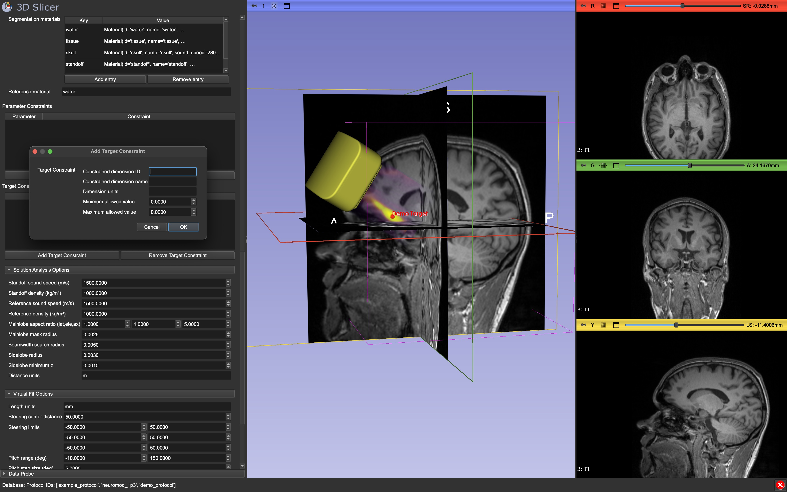

# SlicerOpenLIFU

Low intensity focused ultrasound (LIFU) is a method of neuromodulation. This
uses ultrasound as a non-destructive treatment as opposed to using it for
imaging.

Build this extension by following [the usual procedure for Slicer
extensions](https://slicer.readthedocs.io/en/latest/developer_guide/extensions.html#build-an-extension).

This project is licensed under the GNU Affero General Public License (AGPL).
Please note that this is a copyleft license and may impose restrictions on
combined works. Users intending to integrate this extension into their own
projects should review AGPL compatibility and obligations.

For more information, please visit: [Openwater Early Access
Systems](https://www.openwater.health/early-access-systems)



## 📦 Included Modules

### 🏠 OpenLIFUHome

The central interface module providing navigation controls for other modules.

### 💾 OpenLIFUDatabase

Facilitates communication with a local OpenLIFU database for persistent storage
and retrieval of user data, protocol configurations, and treatment sessions.

### 🔐 OpenLIFULogin

Manages user authentication and account access within the OpenLIFU database.
Primarily used by the standalone OpenLIFU application.

### 📊 OpenLIFUData

Coordinates subject and session data during treatment workflows. Tracks active
subjects, sessions, and computed solutions, and makes them available to all
modules.

### 🧠 OpenLIFUPrePlanning

Enables initial patient setup, including image loading, target selection, and
virtual fitting of an OpenLIFU transducer. Prepares the system for transducer
tracking and sonication planning.

### 🛰️ OpenLIFUTransducerTracker

Imports photos from the Openwater Android app to generate photogrammetric
meshes. These meshes are used to align the transducer with imaging for
neuronavigation.

### 🔬 OpenLIFUSonicationPlanner

Simulates sonication, checks safety parameters, and generates hardware
configurations based on target location and transducer setup.

### 🎯 OpenLIFUSonicationControl

Interfaces with Openwater focused ultrasound transducer hardware to execute
planned sonications. Supports real-time monitoring and device control.

### ⚙️  OpenLIFUProtocolConfig

Manages treatment protocols in the OpenLIFU database, including frequency,
intensity, and pulse duration settings used in planning and treatment.

### 📚 OpenLIFULib

A shared utility library containing core classes and functions used system-wide.
Includes transducer definitions, solution computations, coordinate
transformations, and simulation tools.

## Pairing with 3D Open Water App

### Install Android Platform Tools

**macOS:**  

```bash
brew install android-platform-tools
```

**Linux:**  

```bash
sudo apt update
sudo apt install android-tools-adb
```

**Windows (PowerShell):**  

> Make sure not to run PowerShell as admin.

```powershell
Set-ExecutionPolicy RemoteSigned -Scope CurrentUser
irm get.scoop.sh | iex
scoop install adb
```

Or download from [Google's
platform-tools](https://developer.android.com/tools/releases/platform-tools) and
add it to your `PATH`.

### Enable USB Debugging on Android

1. On your Android device, go to **Settings → About phone → Software information**.
2. Tap **Build number** 7 times until you see "You are now a developer!".
3. Go to **Settings → System → Developer options**.
4. Enable **USB debugging**.
5. When prompted, allow USB debugging access to your computer.  (Check "Always
   allow" to avoid repeated prompts.)

## Meshroom Setup (Optional)

This application is designed to work with the [OpenLIFU 3D Scanner Android app](https://github.com/OpenwaterHealth/OpenLIFU-3DScanner). With credits in the app, computationally intensive tasks such as photogrammetric mesh reconstruction are performed in the cloud, eliminating the need for local Meshroom installation.

If you prefer to perform mesh reconstruction locally instead of using cloud processing, you will need to install Meshroom and add it to your system PATH. Follow the instructions [here](https://github.com/OpenwaterHealth/OpenLIFU-python?tab=readme-ov-file#installing-meshroom) to download and configure Meshroom for local photoscan generation.
