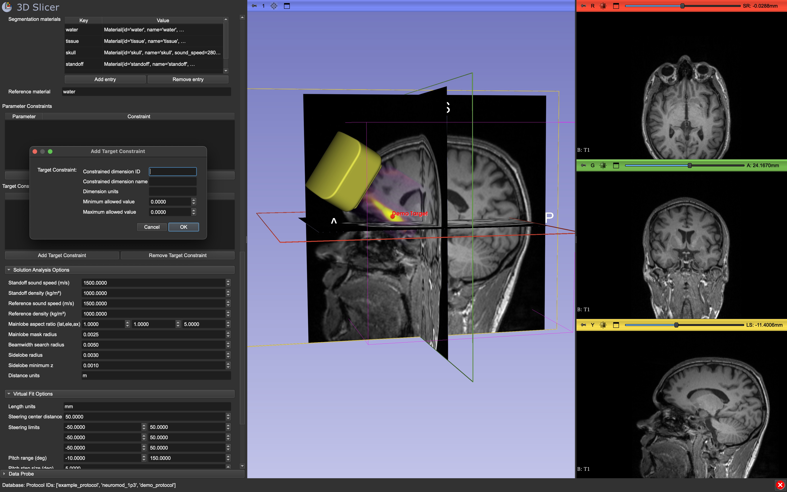

# SlicerOpenLIFU

Low intensity focused ultrasound (LIFU) is a method of neuromodulation. This
uses ultrasound as a non-destructive treatment as opposed to using it for
imaging.

Build this extension by following [the usual procedure for Slicer
extensions](https://slicer.readthedocs.io/en/latest/developer_guide/extensions.html#build-an-extension).

This project is licensed under the GNU Affero General Public License (AGPL).
Please note that this is a copyleft license and may impose restrictions on
combined works. Users intending to integrate this extension into their own
projects should review AGPL compatibility and obligations.

For more information, please visit: [Openwater Early Access
Systems](https://www.openwater.health/early-access-systems)



## 📦 Included Modules

### 🏠 OpenLIFUHome

The central interface module providing navigation controls for other modules.

### 💾 OpenLIFUDatabase

Facilitates communication with a local OpenLIFU database for persistent storage
and retrieval of user data, protocol configurations, and treatment sessions.

### 🔐 OpenLIFULogin

Manages user authentication and account access within the OpenLIFU database.
Primarily used by the standalone OpenLIFU application.

### 📊 OpenLIFUData

Coordinates subject and session data during treatment workflows. Tracks active
subjects, sessions, and computed solutions, and makes them available to all
modules.

### 🧠 OpenLIFUPrePlanning

Enables initial patient setup, including image loading, target selection, and
virtual fitting of an OpenLIFU transducer. Prepares the system for transducer
localization and sonication planning.

### 🛰️ OpenLIFUTransducerLocalization

Imports photos from the Openwater Android app to generate photogrammetric
meshes. These meshes are used to align the transducer with imaging for
neuronavigation.

### 🔬 OpenLIFUSonicationPlanner

Simulates sonication, checks safety parameters, and generates hardware
configurations based on target location and transducer setup.

### 🎯 OpenLIFUSonicationControl

Interfaces with Openwater focused ultrasound transducer hardware to execute
planned sonications. Supports real-time monitoring and device control.

### ⚙️  OpenLIFUProtocolConfig

Manages treatment protocols in the OpenLIFU database, including frequency,
intensity, and pulse duration settings used in planning and treatment.

### 📚 OpenLIFULib

A shared utility library containing core classes and functions used system-wide.
Includes transducer definitions, solution computations, coordinate
transformations, and simulation tools.

## Slicer OpenLIFU Installation Instructions:

## Step 1: Photogrammetry Application Setup

### Install Android Platform Tools for Windows

Download [Google's
platform-tools](https://developer.android.com/tools/releases/platform-tools) for your system.

1. Extract the zip file into a chosen directory for the platform tools download.

2. Click on the extracted "platform-tools" folder, and locate the "adb" file.

3. Copy the file location of the adb file (right click the file, and click "Copy to path.") This should look similar to "C:\Users\Username_Here\Downloads\platform-tools\adb.exe"

4. Go to your system's Control Panel and navigate to "Edit the system environment variables."

5. Click Environment Variables.

6. Navigate to the "Path" variable in either User variables to add the platform tools locally, or System variables to add the tools globally.

7. Click on the "Path" variable and click "Edit."

8. Double click on an empty row in the list of variables. Paste the file location path that contains the adb file.

9. Click ok once on the Path page, and again on the environment variables page.

10. To confirm this has been added correctly, open up a command window and type adb --version into the window. The version number should follow your entry.

This process will allow for the android application build to connect with the desktop application.

#### Other platforms

Linux:

```bash
sudo apt update &&  sudo apt install android-tools-adb
```

macOS:

```bash
brew install android-platform-tools
```

### Download the Android Application.

There are a variety of different builds of the photogrammetry application. Some are located in the OpenLIFU-3DScanner repository located in the OpenwaterHealth Github page.

Please locate the most recent photogrammetry application and download it directly to your designated Android mobile phone. This will normally exist as a .apk file that you may directly click on through your Android phone.

1. Take your designated Android phone and navigate to the OpenwaterHealth github page in a browser of your choice (Chrome, Safari, etc)

2. Click on the "Releases" section in the repository.

3. Select the photogrammetry application version you would like to download.

4. Click on the .apk file of the designated version

5. Allow for all permissions.

6. Please navigate to "Files" in your Android phone.

7. Click on the most recently downloaded app. This will install the application directly to your phone.

### Enable USB Debugging on Android

1. On your Android device, go to **Settings → About phone → Software information**.

2.  Tap **Build number** 7 times until you see "You are now a developer!".

3.  Go to **Settings → System → Developer options**.

4. Enable **USB debugging**.

5. When prompted, allow USB debugging access to your computer.  (Check "Always
   allow" to avoid repeated prompts.)

## Meshroom Setup (Optional)

This application is designed to work with different photogrammetry frameworks, such as the one included with [OpenLIFU 3D Scanner Android app](https://github.com/OpenwaterHealth/OpenLIFU-3DScanner). With credits in the app, computationally intensive tasks such as photogrammetric mesh reconstruction are performed in the cloud, eliminating the need for local Meshroom installation.

If you prefer to perform local mesh reconstruction locally instead of using cloud processing, you will need to install Meshroom and add it to your system PATH. Follow the instructions [here](https://github.com/OpenwaterHealth/OpenLIFU-python?tab=readme-ov-file#installing-meshroom) to download and configure Meshroom for local photoscan generation. Please ensure that you are downloading Meshroom 2023.3.0, as this is the most compatible version with most systems.

### Step 2: Download the SlicerOpenLIFU Extension

Please note that there are two main options for download:

## Option 1 (Manual installation):
The most recent SlicerOpenLIFU Extension can be found in the [repository Releases](https://github.com/OpenwaterHealth/SlicerOpenLIFU/releases/latest). The version of Slicer that must be downloaded for the release is located in the Release notes. Please ensure to download the correct Slicer version for the extension.

1. Download your preferred version of the Slicer Extension from [Releases](https://github.com/OpenwaterHealth/SlicerOpenLIFU/releases).

2. [Download](https://download.slicer.org/) the correct version of Slicer according to the release notes for the designated extension.

3. Launch Slicer.

4. Navigate to "View" in the top left corner.

5. Click on "Manage Extensions."

6. Click "Install from file."

7. Browse for and select the installation package that you downloaded in step 2.

8. Wait for install to be complete, then restart the Slicer app.

## Option 2 (Extension manager):
The SlicerOpenLIFU extension also exists as an extension within Slicer itself.

1. Launch Slicer

2. Navigate to "View" in the top left corner.

3. Click on "Manage Extensions."

4. Type in "OpenLIFU" in the search bar. Locate the OpenLIFU extension and click "Install."

5. Once the installation is complete, you MUST restart the application for the extension to be enabled.

6. If you would like to install another version of the extension, please go to the Releases section of this page and follow the instructions for Option 1. Please note that you MUST uninstall any previous extension versions and restart the application if you would like to install a new extension version.


If you prefer to perform mesh reconstruction locally instead of using cloud processing, you will need to install Meshroom and add it to your system PATH. Follow the instructions [here](https://github.com/OpenwaterHealth/OpenLIFU-python?tab=readme-ov-file#installing-meshroom) to download and configure Meshroom for local photoscan generation.

## Running Integration Tests with DVC (Optional)

SlicerOpenLIFU uses [DVC](https://dvc.org/) to manage test data stored in Google Drive. **Note:** Remote database access is currently restricted to authorized contributors.

### Running Tests

To run integration tests, you need a JSON service account key file for Google Drive access. Contact the developers to obtain `keyfile.json`.

Configure CMake with testing enabled and provide the key file path:
```bash
cmake -DBUILD_TESTING=ON -DDVC_GDRIVE_KEY_PATH=/path/to/keyfile.json ..
```

**Note:** The `DVC_GDRIVE_KEY_PATH` variable is only required when `BUILD_TESTING` is enabled.

Run tests from the build directory:
```bash
ctest -V -C Release
```
The test database (`db_dvc_slicertesting`) will be automatically downloaded to the repository directory when tests run.

### Updating Test Data

To commit changes to the test database, you need additional OAuth credentials. Contact developers for the `gdrive_client_secret`.

Download the latest test database:
```bash
git pull
dvc pull  # Requires service account key or OAuth authentication
```

Commit updates to the test database:

```bash
# Configure DVC for user authentication
dvc remote modify --local gdrive gdrive_client_secret
dvc remote modify --local gdrive gdrive_use_service_account false

# Update and push changes
dvc add db_dvc_slicertesting
git add db_dvc_slicertesting.dvc
git commit -m "Describe updates to test database"
git push
dvc push  # Requires user authentication; does not work with service account
```

To switch back to running tests:
```bash
dvc remote modify --local gdrive gdrive_use_service_account true
```