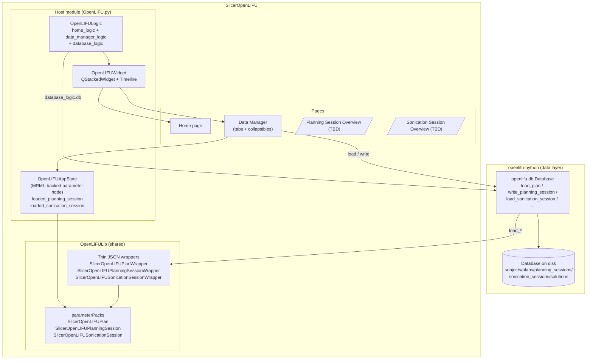
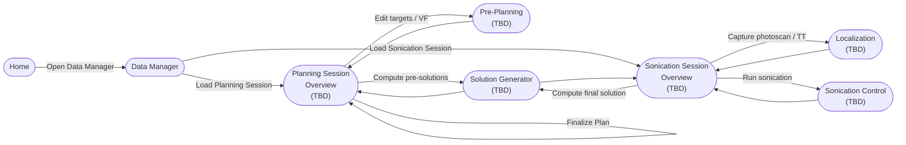
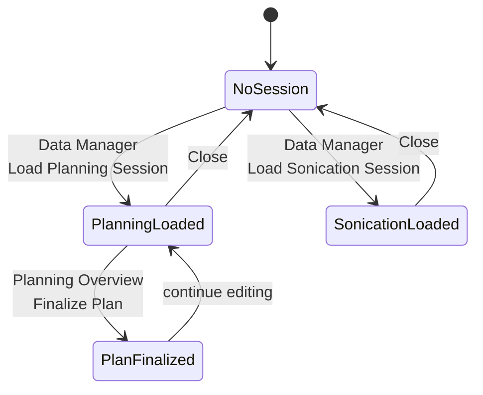

# SlicerOpenLIFU — architecture (session-split refactor, v2)

Status: **living document** — updated as pages land.
Last major update: 2026-07-30 (Data Manager + Home landed;
Session Overview + PrePlanning + Solution Generator +
Localization + Sonication Control still to come).

Companion documents:

* [`data-model.md`](data-model.md) — the split-session data model
  (openlifu-python dataclasses + Slicer parameter packs).
* [`coding-standards.md`](coding-standards.md) — module structure,
  naming conventions, docstring policy, IEC 62304 traceability notes.
* [`../SESSION_SPLIT_DESIGN.md`](../SESSION_SPLIT_DESIGN.md) — the
  design-decision record for the split-session refactor.

## 1. Scope

SlicerOpenLIFU is a 3D Slicer extension that wraps the
`openlifu` Python library with a GUI. This document covers the
architecture of the extension as it stands after the split-session
refactor:

* One host Slicer module (`OpenLIFU`) that owns a stacked
  set of pages.
* A shared library (`OpenLIFULib`) that provides thin JSON wrappers
  and Slicer parameter packs bridging openlifu dataclasses into
  Slicer's parameter node system.
* A cluster of pages (Home, Data Manager, Planning Session Overview,
  ...) that each own one screen of the workflow.
* Fresh split-session pages under `OpenLIFU/OpenLIFUApp/pages/`;
  legacy pages retained under `OpenLIFU/OpenLIFUApp/pages_legacy/`
  as read-only reference material until every fresh replacement
  lands.

## 2. High-level block diagram



Reading this bottom-up: the on-disk database is loaded by
`openlifu.db.Database`; the SlicerOpenLIFU thin wrappers
adapt openlifu's Python objects for Slicer's parameter node
serialization; the parameter packs (`SlicerOpenLIFU*`) attach the
Slicer-side scene data (volume node, target fiducials); pages consume
`OpenLIFUAppState` and touch the database through the host's
`database_logic`.

## 3. Page navigation



The distinguishing feature of the split-session refactor is that
Pre-Planning / Localization / Sonication Control belong to exactly
ONE session type each (planning-only, sonication-only,
sonication-only). The Solution Generator is the exception: it is
mode-agnostic and consumed by both overview pages.

Home and Data Manager are outside the workflow timeline; they are
reachable at any time via the host module's navigation.

## 4. Session lifecycle



`OpenLIFUAppState.loaded_planning_session` and
`OpenLIFUAppState.loaded_sonication_session` are mutually exclusive in
the intended workflow (the Data Manager loads one at a time). The
app state does not enforce that; enforcement is at the load-time
layer (`data_manager_logic.load_planning_session` calls
`close_loaded_sessions()` first).

## 5. Enter / refresh contract (design mandate)

Every page follows this contract:

```mermaid
sequenceDiagram
    participant User
    participant Slicer
    participant Page
    participant AppState
    participant Database

    User->>Slicer: navigate to page
    Slicer->>Page: enter()
    Page->>AppState: read loaded_*
    Page->>Database: read subject-scoped indexes
    Page->>Page: refresh_all() — populate widgets
    User->>Page: click "Load Planning Session"
    Page->>Database: load_planning_session(subject_id, ps_id)
    Database-->>Page: PlanningSession object
    Page->>AppState: state.loaded_planning_session = ...
    Page->>Page: refresh_loaded_labels()
    User->>Slicer: navigate away
    Slicer->>Page: exit()
    Page->>Page: mark not entered; keep state
```

Explicit non-behaviors:

* NO `dataChanged.connect(...)` observers wired across pages. If page
  A's state changes and page B needs to notice, page B will notice
  when the user navigates to it via `enter()`.
* NO cross-page cascades in signal handlers. A button click updates
  local state, then calls `refresh_local()`. Any drift with the
  Slicer scene (e.g. the user moved a target fiducial outside our
  UI) is detected on the next `enter()` and reconciled at the
  session-data-model layer, not through UI observers.

Rationale: this eliminates the "signal chain fires at an unexpected
time and clobbers unrelated state" bug class that motivated the
refactor. Every state read is a fresh read; every render is
idempotent from that read.

## 6. File layout

```
SlicerOpenLIFU/
├── docs/                         — this documentation set
├── OpenLIFU/
│   ├── OpenLIFU.py               — Slicer module registration + re-exports
│   ├── OpenLIFUApp/
│   │   ├── host/                 — host module internals (planned split)
│   │   │   ├── page_registry.py
│   │   │   ├── timeline_widget.py
│   │   │   ├── host_widget.py
│   │   │   ├── host_logic.py
│   │   │   └── host_test.py
│   │   ├── logic/
│   │   │   ├── app_state.py      — OpenLIFUAppState parameter node
│   │   │   └── database_logic.py — DatabaseLogic (owns openlifu.db.Database)
│   │   ├── pages/                — fresh split-session pages
│   │   │   ├── home_page.py
│   │   │   └── data_manager_page.py
│   │   └── pages_legacy/         — pre-split pages; delete when the last
│   │                               fresh replacement lands
│   └── Resources/
├── OpenLIFULib/
│   └── OpenLIFULib/
│       ├── plan.py               — SlicerOpenLIFUPlan parameterPack
│       ├── planning_session.py   — SlicerOpenLIFUPlanningSession parameterPack
│       ├── sonication_session.py — SlicerOpenLIFUSonicationSession parameterPack
│       ├── parameter_node_utils.py — thin JSON wrappers + serializers
│       ├── targets.py            — Point <-> fiducial conversion
│       ├── util.py               — get_app_state / get_cur_db / ...
│       └── ...
└── SESSION_SPLIT_DESIGN.md       — design-decision record
```

## 7. Traceability (IEC 62304)

This section will be filled in when the split-session refactor is
complete and the fresh page set is stable. Placeholder for:

* System requirements table (SR-###) linked to the pages / modules
  that implement them.
* Software architecture description (SAD) linked to the block
  diagram above.
* Verification test cases linked to each requirement.

The design-first workflow used for this refactor (write
`SESSION_SPLIT_DESIGN.md`, then implement) is intended to feed
directly into that IEC 62304 documentation.
