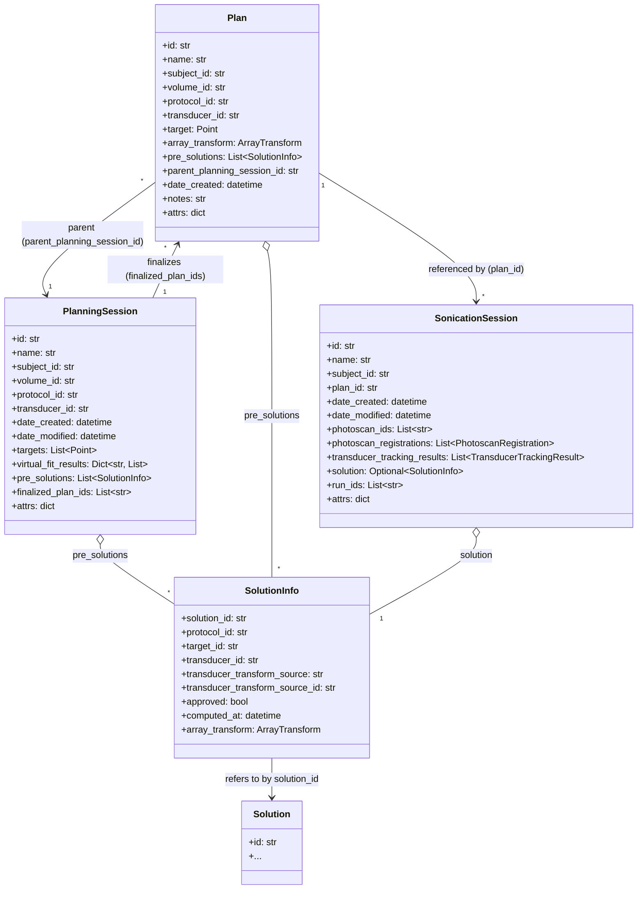
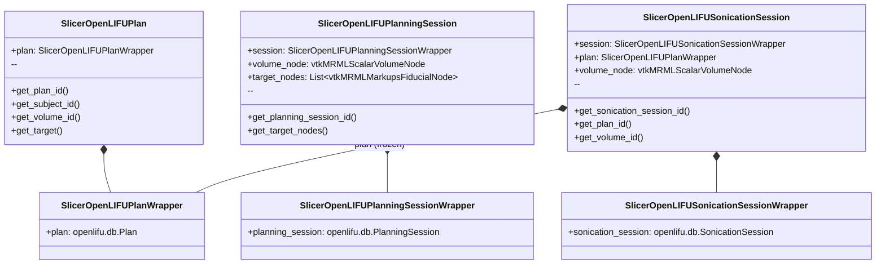

# Split-session data model

Living document. Complements
[`../SESSION_SPLIT_DESIGN.md`](../SESSION_SPLIT_DESIGN.md) (the
design-decision record) with concrete diagrams and field-level
references.

## Class diagram — openlifu-python side



Key invariants (enforced or asserted by design):

* `Plan.parent_planning_session_id` is provenance only. A Plan does
  not depend on its parent PlanningSession still existing.
* A single Solution (on disk at
  `subjects/{sid}/solutions/{solution_id}/{solution_id}.solution.json`)
  can be referenced by any number of `SolutionInfo` records across
  a PlanningSession, a Plan finalized from it, and a
  SonicationSession that consumed it. Solution files are not
  duplicated per referrer.
* `SonicationSession.solution` is `Optional[SolutionInfo]` — at
  most one final solution per session. Recompute replaces in place.

## Class diagram — Slicer side (parameter packs)



Why the two-level nesting (parameterPack → thin wrapper → openlifu
object):

* Slicer's `@parameterNodeWrapper` machinery uses `typing.get_type_hints()`
  at class-definition time. The thin wrapper (`SlicerOpenLIFU*Wrapper`)
  gives Slicer a class name it can resolve without importing
  `openlifu.db` — important because `openlifu` may not yet be
  installed when Slicer first imports our modules.
* The parameterPack layer adds the Slicer scene fields (volume node,
  target fiducials) that don't belong on the openlifu dataclass.

Access pattern: `slicer_session.session.planning_session.<field>`.
Three levels: pack → wrapper → openlifu object.

## Database directory layout

```
{db_root}/
  users/
    users.json
    {user_id}/{user_id}.json
  protocols/
    protocols.json
    {protocol_id}/{protocol_id}.json
  transducers/
    transducers.json
    {transducer_id}/{transducer_id}.json
    {transducer_id}/{transducer_id}_gridweights_{hash}.h5
  subjects/
    subjects.json
    {subject_id}/
      {subject_id}.json
      volumes/
        volumes.json
        {volume_id}/{volume_id}.json + {volume_id}.nii
      photoscans/
        photoscans.json
        {photoscan_id}/{photoscan_id}.json + .obj + .mtl + .png
      photocollections/
        photocollections.json
        {ref_number}/{ref_number}_*.jpg
      solutions/
        solutions.json
        {solution_id}/{solution_id}.solution.json + .solution_analysis.json + .nc
      plans/
        plans.json
        {plan_id}/{plan_id}.plan.json
      planning_sessions/
        planning_sessions.json
        {planning_session_id}/{planning_session_id}.planning.json
      sonication_sessions/
        sonication_sessions.json
        {sonication_session_id}/
          {sonication_session_id}.sonication.json
          runs/{rid}/{rid}.json
```

Heavy artifacts (volumes, photoscans, solutions) live subject-scoped.
Sessions and plans hold `SolutionInfo` refs and id lists; the same
underlying file is never duplicated per referrer.

## Extension naming convention

The type discriminator lives in the filename extension, not in an
id suffix:

| Kind               | Filename                          | Rationale |
|--------------------|-----------------------------------|-----------|
| PlanningSession    | `{id}.planning.json`              | Distinguishes from Plan / SonicationSession sharing the same id. |
| Plan               | `{id}.plan.json`                  | Same. |
| SonicationSession  | `{id}.sonication.json`            | Same. |
| Solution           | `{id}.solution.json`              | Distinguishes from analysis JSON. |
| SolutionAnalysis   | `{id}.solution_analysis.json`     | Companion to `.solution.json`. |

The same id (e.g. `neuromod_1x_demo`) appears on the PlanningSession,
the Plan finalized from it, and the SonicationSession launched from
that Plan.

## Save semantics

Session JSON is written to disk ONLY on explicit user save.

* `set_solution` / `clear_solution` / target moves / photoscan
  add / photoscan remove all mutate the in-memory session and set
  `OpenLIFUAppState.session_is_dirty = True`, but do NOT touch
  disk.
* The Data Manager's "Save" button (or a future dirty-flag prompt on
  page exit) calls `session_actions.save_loaded_session()`, which
  writes both the loaded PlanningSession and SonicationSession
  (whichever are non-null) via `db.write_planning_session(...,
  on_conflict="overwrite")`.
* Solution binary artifacts (`.nc`, `.solution_analysis.json`) are
  derived data. They CAN be written eagerly at compute time; the
  session JSON's `SolutionInfo` entries reference them.

## Related documents

* [`architecture.md`](architecture.md) — module-level layout.
* [`coding-standards.md`](coding-standards.md) — file organisation,
  naming, docstrings.
* [`../SESSION_SPLIT_DESIGN.md`](../SESSION_SPLIT_DESIGN.md) — design
  decisions, staging plan, open questions.
