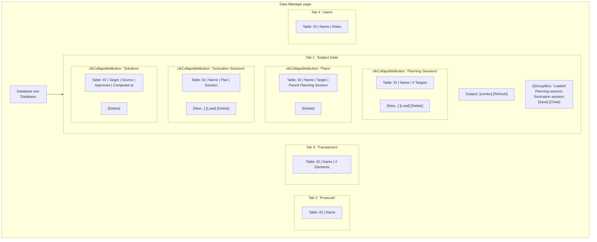
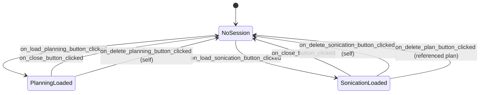

# Data Manager page

Living document — updated as the page changes.
Last major update: 2026-07-30.

## Source

`OpenLIFU/OpenLIFUApp/pages/data_manager_page.py`

## Purpose

CRUD surface for the split-session data model. Owns the paths through
which a user browses subjects, creates and deletes PlanningSessions /
Plans / SonicationSessions, and loads a session into the app state
so downstream pages can operate on it.

Also serves as the current entry point for opening a database
(there is no dedicated Database page in the fresh split-session UI).

## Screen layout

The four Subject Data tables share the same helper (`make_fixed_width_table`)
so their column-width behaviour and tooltip conventions are
identical across the page.

## Public API — Widget

Class: `OpenLIFUDataManagerWidget`.

### Lifecycle

| Method | Purpose |
|---|---|
| `__init__(parent=None)` | Widget construction; sets `moduleName = "OpenLIFU"` and `is_entered = False`. |
| `setup()` | Build the programmatic Qt UI once (database row + tabs). Sets `self.uiWidget`. |
| `enter()` | Sole source of first-render truth. Refreshes every table + label + status. |
| `exit()` | Sets `is_entered = False`. Does NOT tear down state. |
| `cleanup()` | No-op. |

### UI builders

| Method | Purpose |
|---|---|
| `build_database_row()` | Builds the top-row database path label + Load button. Returns a QHBoxLayout. |
| `build_subject_data_tab()` | Builds Tab 1 (subject picker + four collapsible sections + Loaded card). Returns the tab QWidget. |
| `build_loaded_status_group()` | Builds the "Loaded" QGroupBox with Save / Close. Returns the group. |
| `build_protocols_tab()` | Builds Tab 2 (protocols table). Returns the tab. |
| `build_transducers_tab()` | Builds Tab 3 (transducers table). Returns the tab. |
| `build_users_tab()` | Builds Tab 4 (users table). Returns the tab. |
| `make_collapsible_section(*, title, hint, table, actions)` | Wrap a table + action row in a `ctkCollapsibleButton`. Used four times. |

### Refresh helpers

| Method | Purpose |
|---|---|
| `refresh_database_status()` | Update the top-row database path label + colour. |
| `refresh_subject_combo()` | Repopulate the subject combo from the loaded database. |
| `refresh_subject_scoped_lists()` | Rebuild the four subject-scoped tables (planning / plan / sonication / solution). |
| `refresh_loaded_labels()` | Rebuild the "Loaded" card + toggle Save/Close enablement. |
| `refresh_database_scoped_tables()` | Rebuild the Protocols / Transducers / Users tables. |

### Selection helpers

| Method | Purpose |
|---|---|
| `current_subject_id()` | Return the currently-selected subject id, or None. |
| `selected_id_in_table(table)` | Return the id in column 0 of the selected row, or None. |

### Signal handlers

Every handler follows the pattern `on_<widget>_<event>`. All handlers
either mutate state via a `logic.<method>()` call, or open a
dialog / file-picker, then invoke a refresh helper. No handler
touches another page.

| Handler | Reaction |
|---|---|
| `on_subject_combo_changed(*args)` | Guarded by `is_entered`; calls `refresh_subject_scoped_lists()`. |
| `on_refresh_button_clicked()` | Runs every refresh helper. |
| `on_load_db_button_clicked()` | File picker; `database_logic.load_database(path)`; refresh all. |
| `on_new_planning_button_clicked()` | Dialog + `logic.create_planning_session()`; refresh subject-scoped. |
| `on_load_planning_button_clicked()` | `logic.load_planning_session(...)`; refresh loaded labels. |
| `on_delete_planning_button_clicked()` | Confirm + `logic.delete_planning_session(...)`; refresh subject-scoped. |
| `on_delete_plan_button_clicked()` | Confirm + `logic.delete_plan(...)`; refresh subject-scoped. |
| `on_new_sonication_button_clicked()` | Dialog + `logic.create_sonication_session()`; refresh subject-scoped. |
| `on_load_sonication_button_clicked()` | `logic.load_sonication_session(...)`; refresh loaded labels. |
| `on_delete_sonication_button_clicked()` | Confirm + `logic.delete_sonication_session(...)`; refresh subject-scoped. |
| `on_delete_solution_button_clicked()` | Confirm + `db.delete_solution_at_subject_scope(...)`; refresh subject-scoped. |
| `on_save_button_clicked()` | `logic.save_loaded_session()`; refresh subject-scoped. |
| `on_close_button_clicked()` | Confirm + `logic.close_loaded_sessions()`; refresh loaded labels. |

## Public API — Logic

Class: `OpenLIFUDataManagerLogic`. Consumable from a scripted test
without the widget existing.

| Method | Purpose |
|---|---|
| `create_planning_session(*, subject_id, planning_session_id, name, volume_id, protocol_id, transducer_id)` | Build a fresh `openlifu.db.PlanningSession` and write it to disk. |
| `create_sonication_session(*, subject_id, sonication_session_id, name, plan_id)` | Build a fresh `openlifu.db.SonicationSession` (validating the plan exists) and write it. |
| `load_planning_session(subject_id, ps_id)` | Load a PlanningSession + its volume + its target fiducials into the app state. Closes any currently-loaded session first. |
| `load_sonication_session(subject_id, ss_id)` | Load a SonicationSession + its Plan + the Plan's volume into the app state. Closes any currently-loaded session first. |
| `delete_planning_session(subject_id, ps_id)` | Close if loaded; delete from disk. |
| `delete_plan(subject_id, plan_id)` | Close any SonicationSession referencing this plan; delete from disk. |
| `delete_sonication_session(subject_id, ss_id)` | Close if loaded; delete from disk. |
| `save_loaded_session()` | Write the loaded PlanningSession + SonicationSession JSONs to disk. Raises `RuntimeError` if nothing is loaded. |
| `close_loaded_sessions()` | Unload; remove scene nodes each session owned. |

## Module-level helpers

Public per `docs/coding-standards.md` rule 2.

| Symbol | Purpose |
|---|---|
| `SignalBlocker(obj)` | Context manager that blocks Qt signals on `obj`. |
| `make_fixed_width_table(columns)` | Create a `QTableWidget` with `Interactive` resize mode and fixed default column widths from `columns` (`[(header, width_px), ...]`). |
| `fill_table_with_tooltips(table, rows)` | Populate a table + set each cell's tooltip to its full text. |
| `collect_solution_infos_from_sessions(db, subject_id)` | Walk PlanningSessions + Plans + SonicationSessions to collect `{solution_id: SolutionInfo}`. Used by the Solutions table's provenance columns. |
| `require_current_database()` | Return the current `Database`, or raise `RuntimeError`. |
| `load_volume_node_from_database(db, subject_id, volume_id)` | Load a volume into the Slicer scene as a scalar volume node. |
| `create_target_fiducial_node(target)` | Create a fiducial node from an `openlifu.geo.Point`. |
| `confirm_action(text)` | Show a Cancel/OK dialog; return True on OK. |
| `show_info_dialog(text)` / `show_error_dialog(text)` | Modal info / error with a consistent window title. |

## Session lifecycle drivers

The Data Manager is the single entry point through which sessions
enter and leave the app state during normal use:

## Design rationale

* **Tabs instead of one long scroll.** Users, Transducers, and
  Protocols are DB-level concerns that don't depend on which subject
  is picked; separating them into tabs keeps the subject-scoped view
  compact.
* **Collapsible sections in Tab 1.** Four subject-scoped tables can
  push each other off-screen. Collapse the ones the user isn't
  looking at right now.
* **Fixed-width, resizable columns.** `QHeaderView.Interactive` +
  fixed default widths avoids "the columns jump every time the data
  changes" from the default `ResizeToContents` mode. Users can drag
  column edges to widen. Full cell text is always in the tooltip so
  long strings can be inspected without dragging.
* **No cross-page observers.** The Data Manager reads and writes on
  every button click; anything happening on another page is
  discovered on next `enter()`.
* **`refresh_subject_scoped_lists()` reads through the openlifu-python
  `Database` API on every call.** No local cache. This is the same
  path a scripted test would take, giving the manual UI and the
  automated test the same source of truth.

## Acceptance tests

Manual, until automated tests land:

1. Launch, click "Open Data Manager", click Load, pick a database
   directory. The database path label goes green and the subject
   combo populates.
2. Pick a subject. The four subject-scoped tables populate. IDs are
   `neuromod_1x_demo` (etc.) with no `_planning` / `_plan` /
   `_sonication` suffix.
3. Switch tabs. Protocols / Transducers / Users tables populate on
   the first switch and then are static.
4. Select a Planning Session row, click Load. The Loaded card
   updates; Save and Close become enabled.
5. Close. The Loaded card resets and buttons disable.
6. Delete a Planning Session with confirmed. The row disappears; the
   Plans this session finalized remain in the Plans table.

## Related documents

* [`home.md`](home.md) — the page users come to the Data Manager from.
* [`../architecture.md`](../architecture.md) sections 3, 4, 5 — page
  navigation, session lifecycle, enter/refresh contract.
* [`../data-model.md`](../data-model.md) — the data model the Data
  Manager exposes.
