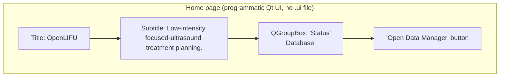
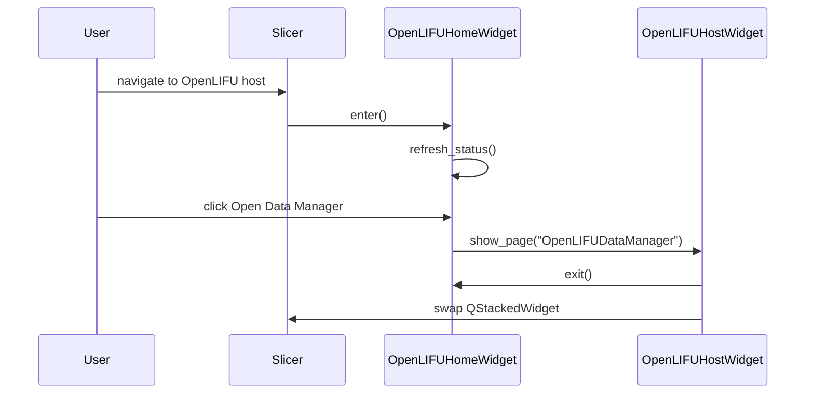

# Home page

Living document — updated as the page changes.
Last major update: 2026-07-30.

## Source

`OpenLIFU/OpenLIFUApp/pages/home_page.py`

## Purpose

Landing page for the OpenLIFU host module. Shows a title, subtitle,
read-only status labels for the currently-loaded database and
session(s), and a single button that navigates to the Data Manager.

Deliberately minimal. Design decision: the landing page has no
sign-in, hardware-connect, cloud-sync, or guided-workflow gating
behaviour of its own. Those are separate concerns handled by other
pages / dialogs so the plumbing can be verified end-to-end without
authentication or hardware in play.

## Screen layout

## Public API

Class: `OpenLIFUHomeWidget` (extends `ScriptedLoadableModuleWidget`).

| Method | Called from | Purpose |
|---|---|---|
| `__init__(parent=None)` | host `_instantiate_page_widget` | Widget construction; sets `moduleName = "OpenLIFU"` and `is_entered = False`. |
| `setup()` | host `_instantiate_page_widget` | Build the programmatic Qt UI once. Sets `self.uiWidget = <top widget>` so the host can embed it. |
| `enter()` | host `_delegate_enter` | Sole source of first-render truth. Sets `is_entered = True`, calls `refresh_status()`. |
| `exit()` | host `_delegate_exit` | Sets `is_entered = False`. Does NOT tear down state. |
| `cleanup()` | Slicer widget teardown | No-op. |
| `build_status_group()` | `setup()` | Build the read-only status QGroupBox. Returns the group. |
| `build_action_row()` | `setup()` | Build the "Open Data Manager" button row. Returns the QVBoxLayout. |
| `refresh_status()` | `enter()` | Repopulate the three status labels from `get_cur_db()` and `get_app_state()`. Idempotent. |
| `on_data_manager_button_clicked()` | signal handler | Navigate to `OpenLIFUDataManager` via the host's `show_page`. |

Class: `OpenLIFUHomeLogic` (extends `ScriptedLoadableModuleLogic`).

Currently empty. Kept in place so the host module's `home_logic`
attribute always references a construct-able object. Future
landing-page behaviour (env-var mode locks, sign-in gating) will
land here.

## State reads

Every call to `refresh_status()` reads:

* `get_cur_db()` — the currently-loaded `openlifu.db.Database` or None.
* `get_app_state().loaded_planning_session` — the currently-loaded
  `SlicerOpenLIFUPlanningSession` or None.
* `get_app_state().loaded_sonication_session` — the currently-loaded
  `SlicerOpenLIFUSonicationSession` or None.

## State writes

The Home page does not mutate state. The one signal handler
(`on_data_manager_button_clicked`) just navigates.

## Signal flow

## Design rationale

* **No `.ui` file.** Home is small enough (four widgets in two
  groups) that a programmatic Qt UI is easier to reason about than
  a designer file. See `docs/coding-standards.md` for the
  "one topic per file" rule -- keeping the layout code in the same
  file as the handlers means one file to open when reading the page.
* **No cross-page observers.** Home reads the app state at
  `enter()` time and repaints. If the app state changes while Home
  is visible (e.g. a background task unloads a session), the change
  is not reflected until the user navigates away and back. That
  trade-off is acceptable because Home is a landing page users move
  through quickly, and it eliminates the "signal fired at an
  unexpected time" bug class the split-session refactor is trying to
  prevent.

## Acceptance tests

Manual, until automated tests land:

1. Launch Slicer with the OpenLIFU host module active. Home is
   visible by default. Verify three status labels show `—` /
   `(none loaded)`.
2. Click "Open Data Manager". The page swaps to the Data Manager.
3. From the Data Manager, load a database and load a Planning
   Session. Navigate back to Home (in a future commit -- the
   navigation is not yet wired the other direction). Verify the
   Planning session label shows the loaded id and subject.
