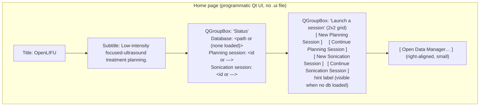
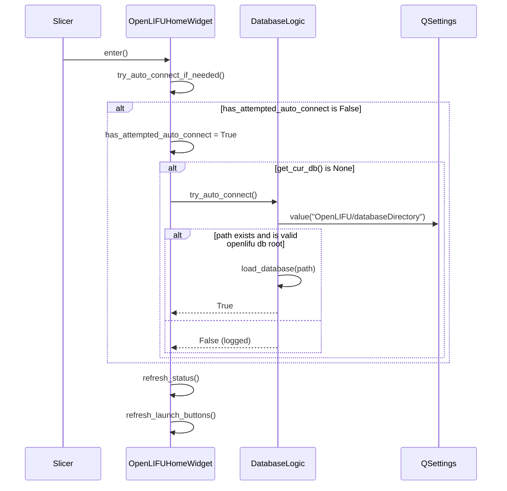
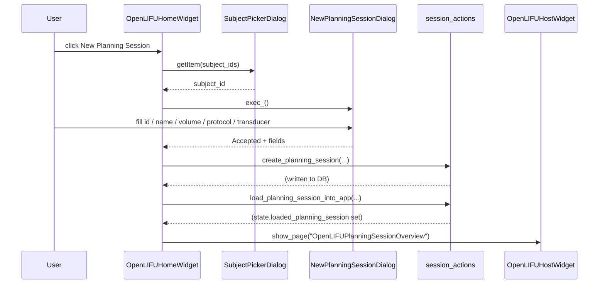

# Home page

Living document — updated as the page changes.
Last major update: 2026-07-30.

## Source

`OpenLIFU/OpenLIFUApp/pages/home_page.py`

## Purpose

Landing page for the OpenLIFU host module. Two jobs:

1. **Auto-connect** the last-used database from
   `QSettings("OpenLIFU/databaseDirectory")` on landing
   (SlicerOpenLIFU#635).
2. **Launch a session** — the clinical workflow's primary entry
   point. Four big buttons (New / Continue × Planning / Sonication)
   run the corresponding create + load flow and swap to the
   appropriate Session Overview page.

The Data Manager is available via a smaller "Open Data Manager…"
link for admin-scoped browsing and CRUD.

Non-goals: no sign-in, hardware-connect, cloud-sync, or
guided-workflow-timeline behaviour on Home.

## Screen layout

## Public API

Class: `OpenLIFUHomeWidget` (extends `ScriptedLoadableModuleWidget`).

| Method | Called from | Purpose |
|---|---|---|
| `__init__(parent=None)` | host `_instantiate_page_widget` | Widget construction; sets `moduleName = "OpenLIFU"`, `is_entered = False`, `has_attempted_auto_connect = False`. |
| `setup()` | host `_instantiate_page_widget` | Build the programmatic Qt UI once. Sets `self.uiWidget = <top widget>` so the host can embed it. |
| `enter()` | host `_delegate_enter` | Sole source of first-render truth. Sets `is_entered = True`, calls `try_auto_connect_if_needed()`, `refresh_status()`, `refresh_launch_buttons()`. |
| `exit()` | host `_delegate_exit` | Sets `is_entered = False`. Does NOT tear down state. |
| `cleanup()` | Slicer widget teardown | No-op. |
| `build_status_group()` | `setup()` | Build the read-only Status QGroupBox. |
| `build_launch_group()` | `setup()` | Build the four-button "Launch a session" grid + hint label. |
| `make_big_button(label, *, tooltip, handler)` | `build_launch_group()` | Factory for the four launch buttons; centralises minimum height + emphasis styling. |
| `build_admin_row()` | `setup()` | Build the "Open Data Manager…" row. |
| `try_auto_connect_if_needed()` | `enter()` | If not yet attempted this session and no DB loaded, call `DatabaseLogic.try_auto_connect()`. |
| `refresh_status()` | `enter()` | Repopulate the three status labels from `get_cur_db()` and `get_app_state()`. Idempotent. |
| `refresh_launch_buttons()` | `enter()` | Enable / disable the four launch buttons based on whether a DB is loaded; set hint label. |
| `on_new_planning_button_clicked()` | signal handler | Prompt for subject, open `NewPlanningSessionDialog`, `create_planning_session()`, `load_planning_session_into_app()`, `navigate_to_host_page("OpenLIFUPlanningSessionOverview")`. |
| `on_continue_planning_button_clicked()` | signal handler | Open `ContinuePlanningSessionDialog`, `load_planning_session_into_app()`, navigate. |
| `on_new_sonication_button_clicked()` | signal handler | Prompt for subject, verify a Plan exists, open `NewSonicationSessionDialog`, `create_sonication_session()`, `load_sonication_session_into_app()`, navigate. |
| `on_continue_sonication_button_clicked()` | signal handler | Open `ContinueSonicationSessionDialog`, `load_sonication_session_into_app()`, navigate. |
| `on_data_manager_button_clicked()` | signal handler | Navigate to `OpenLIFUDataManager`. |
| `prompt_for_subject(database, title)` | `on_new_*_button_clicked` | Modal `SubjectPickerDialog` over `database.get_subject_ids()`. |
| `show_info(text)` / `show_error(text)` | handlers | Thin wrappers over `slicer.util.infoDisplay` / `errorDisplay`. |

Class: `OpenLIFUHomeLogic` (extends `ScriptedLoadableModuleLogic`).

Currently empty. Kept in place so the host module's `home_logic`
attribute always references a construct-able object.

## Auto-connect flow

Key contract points:

* `try_auto_connect_if_needed()` runs **at most once per Slicer
  session**. If the user disconnects the database (from Data
  Manager) and returns to Home, we do NOT re-attempt — that respects
  the explicit user disconnect.
* `DatabaseLogic.try_auto_connect()` is the SOLE call site for the
  persistence key `QSettings("OpenLIFU/databaseDirectory")`. No page
  reads or writes it directly.
* Persistence itself is managed by `DatabaseLogic.load_database()`
  (writes on success) and `DatabaseLogic.unload_database()` (clears
  on disconnect).

## Session-launch flow (Planning)

Continue-flow is the same, with `ContinuePlanningSessionDialog`
(subject + session-id picker) instead of the subject prompt +
`NewPlanningSessionDialog`. Sonication mirrors both.

## State reads

Every call to `refresh_status()` reads:

* `get_cur_db()` — the currently-loaded `openlifu.db.Database` or None.
* `get_app_state().loaded_planning_session` — the currently-loaded
  `SlicerOpenLIFUPlanningSession` or None.
* `get_app_state().loaded_sonication_session` — the currently-loaded
  `SlicerOpenLIFUSonicationSession` or None.

`refresh_launch_buttons()` reads `get_cur_db()` only.

## State writes

* `try_auto_connect_if_needed()` may cause
  `DatabaseLogic.load_database(...)` to fire, which sets
  `DatabaseLogic.db` and writes `QSettings("OpenLIFU/databaseDirectory")`.
* `on_new_*_button_clicked()` writes to the database (new session)
  and to `get_app_state().loaded_*_session`.
* `on_continue_*_button_clicked()` writes only to
  `get_app_state().loaded_*_session`.

## Design rationale

* **Auto-connect is Home-only.** No other page invokes
  `try_auto_connect()`. Connect / disconnect is an app-wide state
  change; concentrating the trigger keeps the model predictable and
  avoids "which page opened the database?" ambiguity.
* **Auto-connect runs at most once per session.** Respects an
  explicit user disconnect; matches the "opened OpenLIFU → my last
  database is there" mental model without fighting the user.
* **Subject picker before the New-* dialog.** Home does not host a
  persistent subject combo (that's a Data Manager job). A bespoke
  `SubjectPickerDialog` in `session_dialogs.py` is used rather than
  `qt.QInputDialog.getItem`, whose return-value shape is
  inconsistent under PythonQt (returns a bare `str` instead of the
  documented `(text, ok)` tuple on some builds).
* **Continue picker is single-dialog.** Users pick subject and
  session inside `ContinuePlanningSessionDialog` /
  `ContinueSonicationSessionDialog` (subject combo on top, session
  list below). Double-clicking a row acts as Load.
* **No cross-page observers.** Home reads app state at `enter()`
  time and repaints. If a background action mutates state while
  Home is visible, the change is not reflected until the user
  navigates away and back. Acceptable because Home is a
  through-page users move through quickly.
* **`New Sonication Session` availability is click-time-checked.**
  We do not walk `database.get_plan_ids()` for every subject on
  each `enter()` (would touch disk on every navigation). If the
  user clicks and no Plan exists, an info dialog explains.

## Acceptance tests

Manual, until automated tests land:

1. Launch Slicer with the OpenLIFU host module active. Home is
   visible by default. On first-ever launch:
   * DB label shows `(none loaded)`.
   * Four launch buttons are disabled with hint
     "Load a database from the Data Manager to enable session actions.".
2. Open Data Manager, load a database. Return to Home
   (or wait for a page re-enter). Status label populates; four
   buttons enable; hint disappears.
3. Exit Slicer. Relaunch. Home shows the same database as already
   connected — no need to reopen the Data Manager.
4. From Data Manager, click Disconnect (or `unload_database`).
   Exit Slicer. Relaunch. Home shows `(none loaded)`.
5. Click **New Planning Session** → subject picker → New dialog →
   fill fields → OK. Verify the Planning Session Overview page
   appears and shows the new session.
6. Click **Continue Planning Session** → picker (subject + session
   list) → double-click a row. Verify the Planning Session Overview
   page appears with the chosen session.
7. Same for New / Continue Sonication Session.
8. Repeated navigations to Home within a single Slicer session do
   NOT trigger a second auto-connect attempt after the first.

## Related

* [`../coding-standards.md`](../coding-standards.md) — enter/refresh
  contract, no-cross-page-reach-ins rule that Home follows by
  routing session actions through `OpenLIFUApp.logic.session_actions`.
* [`data-manager.md`](data-manager.md) — admin panel; still the
  place for CRUD on the DB. Home's launch buttons are a workflow
  entry point, not a replacement.
* SlicerOpenLIFU#635 — issue that scoped this change.
