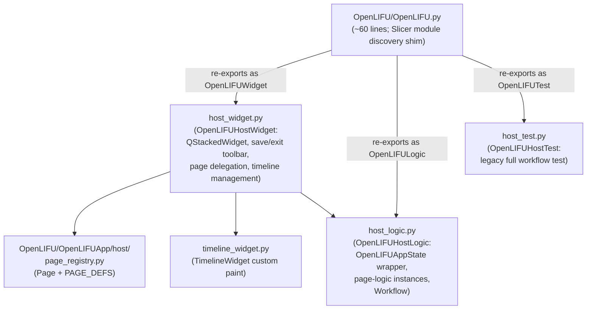
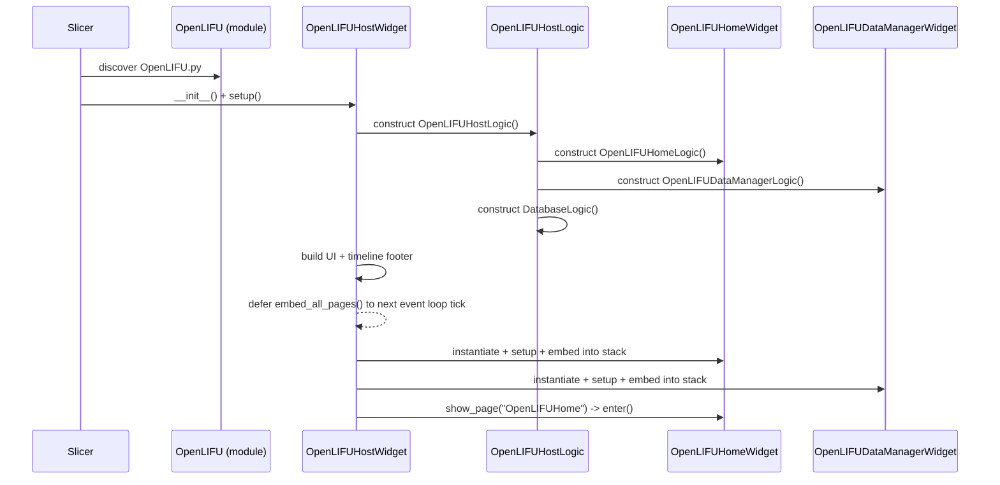

# OpenLIFU host module

Living document — updated as the host changes.
Last major update: 2026-07-30.

## Source

`OpenLIFU/OpenLIFU.py` and `OpenLIFU/OpenLIFUApp/host/*.py`.

## Purpose

Slicer sees a single "OpenLIFU" module at load time. That module is
implemented as a **host** that owns a `QStackedWidget` of embedded
pages (Home, Data Manager, and future workflow pages) and provides:

* A shared header (database / login / device status icons).
* A shared save / exit toolbar that operates on whatever session is
  loaded via the Data Manager.
* A shared timeline strip at the bottom (for workflow pages).
* Delegation of `enter()` / `exit()` / `cleanup()` down to the
  currently-visible page widget.

Pages themselves are `ScriptedLoadableModuleWidget` classes but are
not Slicer modules -- they exist only inside the host. The host owns
their lifecycle.

## Files



`OpenLIFU/OpenLIFU.py` defines the required `class OpenLIFU(ScriptedLoadableModule)`
registration and re-exports the other three classes so Slicer's
`getattr(module, "<Name>Widget")` lookups still work.

## Layout: fixed header + scrollable page + fixed footer

The host's `OpenLIFU.ui` places five items in a `QVBoxLayout` with
no margins or spacing:

```
hostMainLayout
  ├─ hostHeaderContainer  (Save / Exit toolbar, module status icons)
  ├─ hostHeaderRule       (thin separator)
  ├─ pageStack            (QStackedWidget of embedded pages)
  ├─ hostFooterRule       (thin separator)
  └─ hostFooterContainer  (Back-to-Home + timeline strip + Next)
```

The fixed-chrome contract (SlicerOpenLIFU#643) is:

1. **Outer host widget** has `SizePolicy(Preferred, Expanding)` -- it
   takes whatever vertical space the module panel viewport gives it
   and never grows past.
2. **`pageStack`** also has `SizePolicy(Preferred, Expanding)` -- it
   absorbs the height left after the header + rule + rule + footer
   rows.
3. **Each embedded page** wraps its content in a `QScrollArea` (via
   `OpenLIFULib.module_layout.wrap_page_in_scroll_area`) with
   `setWidgetResizable(True)` and `Expanding` vertical size policy.
   When the page content exceeds the pageStack's allotted height,
   only the scroll area's viewport scrolls; the host's header and
   footer stay pinned.

Steps 1 + 2 are set in `OpenLIFUHostWidget.setup()`. Step 3 is
per-page (the page's `setup()` calls `wrap_page_in_scroll_area(top)`
and stores the returned scroll area as `self.uiWidget`).

Mirror of the legacy `apply_module_layout` pattern, which wrapped
each legacy `.ui`-file-driven page in a scroll area with the same
properties. `wrap_page_in_scroll_area` is the slim analogue for the
new programmatic-UI pages, which don't have the header /
workflow-controls placeholder pattern that `apply_module_layout`
assumes.

## Startup flow



## Public API — Widget

Class: `OpenLIFUHostWidget` (re-exported as `OpenLIFUWidget`).

Reachable from other Python code via
`slicer.util.getModule("OpenLIFU").widgetRepresentation().self()`.

| Method | Purpose |
|---|---|
| `show_page(module_name)` | Swap the visible page to the one registered under `module_name`. Called by pages that navigate. |
| `get_page_widget(module_name)` | Return the embedded widget instance. Public accessor for cross-page reads (see `docs/coding-standards.md` rule 6 for the coordination policy). |
| `onSaveClicked(checked)` | Save the loaded session via `session_actions.save_loaded_session()`. Save button is **hidden** unless a session is loaded and dirty (SlicerOpenLIFU#638) -- a greyed-out button in the primary header slot is more distracting than informative. Appears the moment `mark_session_dirty` fires and disappears again after a successful save. |
| `onExitClicked(checked)` | Confirm-close the loaded session and navigate to Home. Exit button is **hidden** when no session is loaded (SlicerOpenLIFU#638); the footer's Back-to-Home button gives the user a navigation escape on non-Home pages regardless. |
| `onBackToHomeClicked(checked)` | Same but without the "there is no session" error. Footer button visible on **every non-Home page** -- Data Manager, both Session Overviews, and any workflow-timeline page (Target Selection today) -- so users always have a way back to Home even when the toolbar Exit is hidden or when they want out of a timeline page. Broadened from the previous "non-timeline only" rule in SlicerOpenLIFU#641; original visibility fix in SlicerOpenLIFU#637. |
| `onNextClicked(checked)` | Advance in the workflow timeline (currently no timeline pages -- kept for future). |

The internal helpers (`_embed_all_pages`, `_refresh_timeline_state`,
etc.) still carry leading underscores. A follow-up commit will rename
them to public per the coding-standards convention.

## Public API — Logic

Class: `OpenLIFUHostLogic` (re-exported as `OpenLIFULogic`).

Reachable via `slicer.util.getModuleLogic("OpenLIFU")`.

| Attribute | Type | Purpose |
|---|---|---|
| `workflow` | `Workflow` | Guided-mode step gating. |
| `home_logic` | `OpenLIFUHomeLogic` | Home page's Logic (empty today; kept as a hook). |
| `data_manager_logic` | `OpenLIFUDataManagerLogic` | Data Manager's Logic. Now scoped to admin-only deletion methods (SlicerOpenLIFU#635); load/save/close moved to `OpenLIFUApp.logic.session_actions`. |
| `database_logic` | `DatabaseLogic` | Owns the currently-loaded `openlifu.db.Database`. `get_cur_db()` reads `.db` off this. |

| Method | Purpose |
|---|---|
| `getParameterNode()` | Return the cached `OpenLIFUAppState` wrapper around the host's MRML parameter node. Cache guards against re-entrancy during initial default-write. |
| `start_guided_mode()` | Enter guided mode + jump to the workflow start. |
| `workflow_jump_ahead()` | Jump to the furthest reachable step. |
| `workflow_go_to_start()` | Navigate to the starting module of the workflow. |

## Session-split refactor status

Only new-model pages are embedded:

* `OpenLIFUHome` — [`../pages/home.md`](../pages/home.md)
* `OpenLIFUDataManager` — [`../pages/data-manager.md`](../pages/data-manager.md)

Legacy pages live under `OpenLIFU/OpenLIFUApp/pages_legacy/`. Their
Slicer widgets are NOT instantiated; the host does not embed them.
The legacy full-workflow test in `host_test.py` still imports from
`pages_legacy` for now and will be rewritten as each fresh
replacement lands.

## Related documents

* [`../architecture.md`](../architecture.md) — high-level block
  diagram + page navigation + session lifecycle.
* [`../coding-standards.md`](../coding-standards.md) — the
  size-ceiling rule (rule 1) that motivated the split.
* [`README.md`](README.md) — per-page documentation index.
