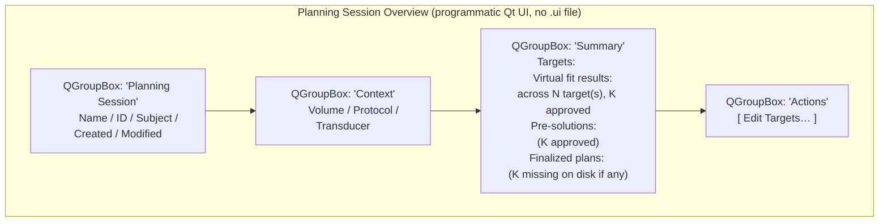

# Planning Session Overview page

Living document — updated as the page changes.
Last major update: 2026-07-30 (revised per SlicerOpenLIFU#634 —
information-only, no action buttons, no rich tables).
Tracking: SlicerOpenLIFU#633, SlicerOpenLIFU#634.

## Source

`OpenLIFU/OpenLIFUApp/pages/planning_session_overview_page.py`

## Purpose

**Information-only** status card for the currently-loaded
PlanningSession. Displays the session's identity, context, and
count-based summaries of its editable content. Nothing here mutates
session state — that's the exclusive province of subsequent workflow
pages (Pre-Planning owns targets + VF, Solution Generator owns
pre-solutions, etc.).

Users reach this page from Home's **New Planning Session** or
**Continue Planning Session** buttons (SlicerOpenLIFU#635), or by
Loading a Planning Session from the Data Manager.

## Screen layout

Notably absent (deliberately):

* No tables (target list, VF list, pre-solution list, finalized-plan
  list). Each list has an editing surface on a later page and would
  duplicate that here.
* No editing controls. The Actions group is navigation-only -- each
  button jumps into the workflow page that owns the corresponding
  editing surface. As more workflow pages land (Virtual Fit,
  Solution Generator, Finalize Plan), the Actions group grows.
* No Finalize Plan button. Finalize is a workflow-completion action;
  it will land on Pre-Planning (leading candidate) or the workflow
  toolbar in a follow-up commit for SlicerOpenLIFU#634.

## Public API — Widget

Class: `OpenLIFUPlanningSessionOverviewWidget`.

### Lifecycle

| Method | Purpose |
|---|---|
| `__init__(parent=None)` | Widget construction; sets `moduleName = "OpenLIFU"` and `is_entered = False`. |
| `setup()` | Build the programmatic Qt UI once. Sets `self.uiWidget`. |
| `enter()` | Sole source of first-render truth. Calls `refresh_all()`. |
| `exit()` | Sets `is_entered = False`. |
| `cleanup()` | No-op. |

### UI builders

| Method | Purpose |
|---|---|
| `build_header_group()` | Session name / id / subject / dates group. |
| `build_context_group()` | Volume / protocol / transducer group. |
| `build_summary_group()` | Count-based summary group (four rows). |
| `build_actions_group()` | Navigation buttons into the workflow pages that mutate session state. |

### Refresh + helpers

| Method | Purpose |
|---|---|
| `refresh_all()` | Rebuild every label from `get_app_state().loaded_planning_session`. Enables the Edit Targets… button. |
| `render_no_session_loaded()` | Reset every label to `—` and disable the Edit Targets… button. |
| `build_targets_summary(session)` | `"N (id1, id2, id3, ...)"` |
| `build_vf_summary(session)` | `"N across M target(s), K approved"` |
| `build_pre_solutions_summary(session)` | `"N (K approved)"` |
| `build_finalized_plans_summary(session)` | `"N"` or `"N (K missing on disk)"` |

### Signal handlers

| Method | Purpose |
|---|---|
| `on_edit_targets_button_clicked(_checked)` | Navigate to `OpenLIFUTargetSelection` (SlicerOpenLIFU#640). |

## Public API — Logic

Class: `OpenLIFUPlanningSessionOverviewLogic`. **Empty.** Retained so
the host's page-logic construction contract is consistent. No business
logic lives here.

## Finalize Plan

Not on this page. See [`../../SESSION_SPLIT_DESIGN.md`](../../SESSION_SPLIT_DESIGN.md)
section 8 (design revision pending under SlicerOpenLIFU#634) and
`OpenLIFU/OpenLIFUApp/plan_finalization.py` for the current home of
the `finalize_plan()` function + `FinalizePlanDialog`. Whichever page
grows the finalize button in the follow-up commit will import from
there.

## Design rationale

* **Information-only.** A user on Session Overview is *deciding*
  what to do next, not *doing* it. Save the doing for pages that
  own the corresponding controls.
* **Summaries not tables.** Tables invite you to interact; a count
  invites you to move on. Deliberate.
* **Preserve the "loaded X ago" / notes / tutorial link ideas.**
  These are legitimate additions for Session Overview -- non-mutating
  polish that supports orientation without becoming a workflow page.
  Not built here yet.
* **No cross-page observers.** Reads on `enter()`; refreshes are
  idempotent.

## Acceptance tests

Manual, until scripted tests land:

1. Load a Planning Session from the Data Manager (`neuromod_1x_demo`
   in the sample DB). Page opens automatically with the session's
   details filled in.
2. Summary group shows counts: e.g. `1 (Target_2)`, `10 across 1
   target, 1 approved`, `none computed`, `1`.
3. Page has no buttons and no editable widgets. Every widget is a
   read-only `QLabel`.
4. Close the session in the Data Manager and navigate back. Every
   label reads `—`.

## Related documents

* [`README.md`](README.md) — page docs index.
* [`data-manager.md`](data-manager.md) — the page users come from.
* [`sonication-session-overview.md`](sonication-session-overview.md) —
  the page's structural sibling.
* [`../../SESSION_SPLIT_DESIGN.md`](../../SESSION_SPLIT_DESIGN.md)
  section 8 — Plan finalization design (being revised under
  SlicerOpenLIFU#634).
