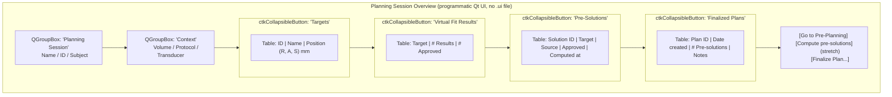
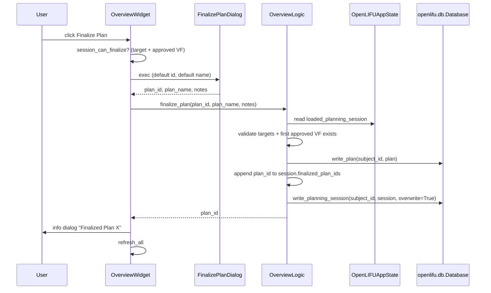

# Planning Session Overview page

Living document — updated as the page changes.
Last major update: 2026-07-30.
Tracking: SlicerOpenLIFU#633.

## Source

`OpenLIFU/OpenLIFUApp/pages/planning_session_overview_page.py`

## Purpose

Read-only status card for the currently-loaded PlanningSession.
Shows the session's key fields, sub-tables of targets / virtual-fit
results / pre-solutions / finalized plans, and hosts the actions the
user takes at the session level:

* Navigate to Pre-Planning (disabled until that page lands).
* Navigate to Solution Generator to compute pre-solutions (disabled
  until that page lands).
* **Finalize Plan** — freeze the currently-approved virtual fit +
  target into a new immutable `Plan` record on disk. Implemented and
  working in this commit.

Users reach this page automatically after Loading a Planning Session
from the Data Manager.

## Screen layout

## Public API — Widget

Class: `OpenLIFUPlanningSessionOverviewWidget`.

### Lifecycle

| Method | Purpose |
|---|---|
| `__init__(parent=None)` | Widget construction; sets `moduleName = "OpenLIFU"` and `is_entered = False`. |
| `setup()` | Build the programmatic Qt UI once. Sets `self.uiWidget`. |
| `enter()` | Sole source of first-render truth. Sets `is_entered = True`, calls `refresh_all()`. |
| `exit()` | Sets `is_entered = False`. Does NOT tear down state. |
| `cleanup()` | No-op. |

### UI builders

| Method | Purpose |
|---|---|
| `build_header_group()` | Session name / id / subject QGroupBox. |
| `build_metadata_group()` | Volume / protocol / transducer QGroupBox. |
| `build_targets_section()` | Collapsible Targets table. |
| `build_virtual_fit_section()` | Collapsible Virtual Fit Results table. |
| `build_pre_solutions_section()` | Collapsible Pre-Solutions table. |
| `build_finalized_plans_section()` | Collapsible Finalized Plans table. |
| `build_action_row()` | Bottom row of buttons. |
| `make_collapsible_section(title, table)` | Wrap a table in a `ctkCollapsibleButton`. |

### Refresh + helpers

| Method | Purpose |
|---|---|
| `refresh_all()` | Rebuild every widget from `get_app_state().loaded_planning_session`. If no session loaded, calls `render_no_session_loaded()`. |
| `render_no_session_loaded()` | Empty all tables + reset labels to "—" + disable Finalize. |
| `session_can_finalize(session)` | Return True iff the session has at least one target with an approved virtual fit. |

### Signal handlers

| Handler | Reaction |
|---|---|
| `on_finalize_button_clicked()` | Prompt via `FinalizePlanDialog`; call `logic.finalize_plan(plan_id, plan_name, notes)`; refresh. |

## Public API — Logic

Class: `OpenLIFUPlanningSessionOverviewLogic`.

| Method | Purpose |
|---|---|
| `finalize_plan(*, plan_id, plan_name, notes)` | Freeze the currently-loaded PlanningSession into a new `Plan`. See "Finalize Plan flow" below. Returns the plan id. |

## Finalize Plan flow

Implements section 8 of `SESSION_SPLIT_DESIGN.md`:

Validation errors from `finalize_plan()`:

* `RuntimeError` — no PlanningSession loaded / no targets / no approved VF / no database loaded.
* `ValueError` — a Plan with `plan_id` already exists for this subject.

Pre-solutions filtering: only pre-solutions with
`transducer_transform_source == "virtual_fit"` and `target_id == primary_target.id`
are copied into the new Plan's `pre_solutions` list. Others (localization-source,
different-target) are left on the PlanningSession only.

## Design rationale

* **Read-only status card.** Editing targets happens on Pre-Planning;
  editing / recomputing solutions happens on Solution Generator. This
  page just displays what the current session holds and provides the
  session-level actions.
* **Multiple Plans per PlanningSession, first-class.** The Finalized
  Plans section is a table, not a single field, because the primary
  design decision from `SESSION_SPLIT_DESIGN.md` section 12 was
  "multiple Plans per PlanningSession supported".
* **Finalize picks the first approved VF for the first target.** MVP
  behaviour. Multi-target multi-Plan finalization is a future feature.
* **No cross-page observers.** Reads on `enter()`; refreshes after
  every button handler. If pre-solutions are added elsewhere the
  section is repainted on next `enter()`.

## Acceptance tests

Manual, until scripted tests land:

1. Load a Planning Session from the Data Manager (`neuromod_1x_demo`
   in the sample DB). The page opens automatically with the session's
   details filled in.
2. The Targets table shows the session's target(s) with position.
3. The Virtual Fit Results table shows target `Target_2` (or similar)
   with counts.
4. The Pre-Solutions table is empty (no pre-solutions in the sample
   sessions yet).
5. Finalized Plans lists the plan that was created by the sample DB
   migration (`neuromod_1x_demo`).
6. Click Finalize Plan. Dialog opens with default id
   `neuromod_1x_demo_<timestamp>` and the session's name.
7. Accept. Info dialog reports "Finalized Plan
   neuromod_1x_demo_<timestamp>".
8. Finalized Plans table gains the new row.
9. Navigate back to Data Manager; the new plan appears in the Plans
   table for the subject.

## Related documents

* [`README.md`](README.md) — page docs index.
* [`data-manager.md`](data-manager.md) — the page users come from.
* [`../data-model.md`](../data-model.md) — the Plan / PlanningSession
  types.
* [`../../SESSION_SPLIT_DESIGN.md`](../../SESSION_SPLIT_DESIGN.md)
  section 8 — the Plan finalization design.
