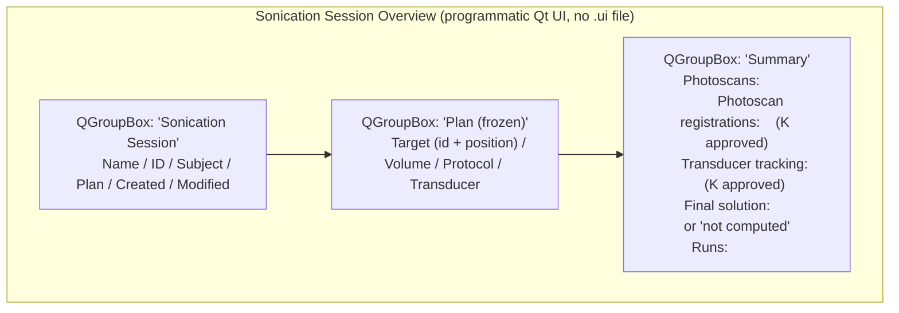

# Sonication Session Overview page

Living document — updated as the page changes.
Last major update: 2026-07-30 (revised per SlicerOpenLIFU#634 —
information-only, no action buttons, no rich tables).
Tracking: SlicerOpenLIFU#633, SlicerOpenLIFU#634.

## Source

`OpenLIFU/OpenLIFUApp/pages/sonication_session_overview_page.py`

## Purpose

**Information-only** status card for the currently-loaded
SonicationSession. Displays the session's identity, the frozen
Plan-derived context, and count-based summaries of the session's
editable content. Nothing here mutates session state -- photoscans /
registrations / TT results / runs are all owned by later workflow
pages (Localization / Sonication Control).

Users reach this page automatically after Loading a Sonication
Session from the Data Manager.

## Screen layout

Notably absent (deliberately):

* No tables (photoscan list, registration list, TT list, runs list).
  Each list has an editing surface on Localization or Sonication
  Control.
* No navigation buttons. Workflow navigation happens through the
  timeline footer on the host module; this page owns no page-swap
  actions.

## Public API — Widget

Class: `OpenLIFUSonicationSessionOverviewWidget`.

### Lifecycle

| Method | Purpose |
|---|---|
| `__init__(parent=None)` | Widget construction; sets `moduleName = "OpenLIFU"`. |
| `setup()` | Build the programmatic Qt UI once. |
| `enter()` | Sole source of first-render truth. Calls `refresh_all()`. |
| `exit()` | Sets `is_entered = False`. |
| `cleanup()` | No-op. |

### UI builders

| Method | Purpose |
|---|---|
| `build_header_group()` | Session name / id / subject / plan / dates group. |
| `build_plan_group()` | Read-only Plan-derived fields group. |
| `build_summary_group()` | Count-based summary group (five rows). |

### Refresh + helpers

| Method | Purpose |
|---|---|
| `refresh_all()` | Rebuild every label from `get_app_state().loaded_sonication_session`. |
| `render_no_session_loaded()` | Reset every label to `—`. |
| `build_photoscans_summary(session)` | `"N"` or `"none captured"`. |
| `build_registrations_summary(session)` | `"N (K approved)"` or `"none"`. |
| `build_tt_summary(session)` | `"N (K approved)"` or `"none"`. |
| `build_solution_summary(session)` | `"<id> · from <source> · <approved|unapproved>"` or `"not computed"`. |
| `build_runs_summary(session)` | `"N"` or `"none performed"`. |

## Public API — Logic

Class: `OpenLIFUSonicationSessionOverviewLogic`. **Empty.** Retained
so the host's page-logic construction contract is consistent.

## Design rationale

* **Information-only.** Same principle as the Planning Session
  Overview: a user on Session Overview is choosing a next step, not
  taking a step.
* **Plan is displayed frozen.** The Plan reference on a
  SonicationSession is immutable input; the plan-derived group is
  styled as such (`Plan (frozen)`).
* **Solution summary condensed into one line.** Multi-line "Final
  Solution" group has been folded into the `Final solution:` line in
  the summary group.
* **No cross-page observers.** Reads on `enter()`; idempotent.

## Acceptance tests

Manual, until scripted tests land:

1. Load a Sonication Session from the Data Manager. Page opens
   automatically with the session's details filled in.
2. Header shows Name / ID / Subject / Plan / Created / Modified.
3. Plan (frozen) group shows Target (id + `R, A, S` mm position),
   Volume, Protocol, Transducer.
4. Summary group shows counts: e.g. `1`, `1 (1 approved)`, `1 (1
   approved)`, `not computed`, `none performed`.
5. Page has no buttons and no editable widgets. Every widget is a
   read-only `QLabel`.
6. Close the session and navigate back. Every label reads `—`.

## Related documents

* [`README.md`](README.md) — page docs index.
* [`data-manager.md`](data-manager.md) — the page users come from.
* [`planning-session-overview.md`](planning-session-overview.md) —
  the page's structural sibling.
* [`../data-model.md`](../data-model.md) — the SonicationSession /
  Plan types.
