# Sonication Session Overview page

Living document — updated as the page changes.
Last major update: 2026-07-30.
Tracking: SlicerOpenLIFU#633.

## Source

`OpenLIFU/OpenLIFUApp/pages/sonication_session_overview_page.py`

## Purpose

Read-only status card for the currently-loaded SonicationSession.
Shows the session's key fields plus the frozen fields inherited from
its referenced `Plan` (target, volume, protocol, transducer,
array_transform). Sub-tables display the photoscans owned by the
session, the photoscan registrations attempted, the transducer-
tracking results, the final Solution (at most one — see
`SESSION_SPLIT_DESIGN.md` section 12 decision 4), and the runs
performed.

Navigation buttons for the Localization / Solution Generator /
Sonication Control pages are placeholders until those pages land.

Users reach this page automatically after Loading a Sonication
Session from the Data Manager.

## Screen layout

```mermaid
flowchart TB
    subgraph SSO["Sonication Session Overview (programmatic Qt UI, no .ui file)"]
      HEAD["QGroupBox: 'Sonication Session'
        Name / ID / Subject / Plan"]
      PLAN["QGroupBox: 'Plan (frozen)'
        Target / Volume / Protocol / Transducer"]

      subgraph PS["ctkCollapsibleButton: 'Photoscans'"]
        PS_T["Table: Photoscan ID"]
      end

      subgraph REG["ctkCollapsibleButton: 'Photoscan Registrations'"]
        REG_T["Table: Registration ID | Photoscan | Approved"]
      end

      subgraph TT["ctkCollapsibleButton: 'Transducer Tracking Results'"]
        TT_T["Table: TT Result ID | Target | Photoscan | Registration | Approved"]
      end

      SOL["QGroupBox: 'Final Solution'
        Solution ID / Source / Approved / Computed at"]

      subgraph RUNS["ctkCollapsibleButton: 'Runs'"]
        RUNS_T["Table: Run ID"]
      end

      BTNS["[Go to Localization] [Compute solution] [Go to Sonication Control]"]

      HEAD --> PLAN --> PS --> REG --> TT --> SOL --> RUNS --> BTNS
    end
```

## Public API — Widget

Class: `OpenLIFUSonicationSessionOverviewWidget`.

### Lifecycle

| Method | Purpose |
|---|---|
| `__init__(parent=None)` | Widget construction; sets `moduleName = "OpenLIFU"` and `is_entered = False`. |
| `setup()` | Build the programmatic Qt UI once. Sets `self.uiWidget`. |
| `enter()` | Sole source of first-render truth. Sets `is_entered = True`, calls `refresh_all()`. |
| `exit()` | Sets `is_entered = False`. |
| `cleanup()` | No-op. |

### UI builders

| Method | Purpose |
|---|---|
| `build_header_group()` | Session name / id / subject / plan QGroupBox. |
| `build_plan_group()` | Plan-derived fields QGroupBox (read-only). |
| `build_photoscans_section()` | Collapsible Photoscans table. |
| `build_registrations_section()` | Collapsible Photoscan Registrations table. |
| `build_tt_section()` | Collapsible Transducer Tracking Results table. |
| `build_solution_group()` | Final Solution QGroupBox. |
| `build_runs_section()` | Collapsible Runs table. |
| `build_action_row()` | Bottom row of navigation buttons. |
| `make_collapsible_section(title, table)` | Wrap a table in a `ctkCollapsibleButton`. |

### Refresh + helpers

| Method | Purpose |
|---|---|
| `refresh_all()` | Rebuild every widget from `get_app_state().loaded_sonication_session`. |
| `render_no_session_loaded()` | Reset every label to "—" and empty every table. |

## Public API — Logic

Class: `OpenLIFUSonicationSessionOverviewLogic`.

Empty for now; retained as a hook for the actions those disabled
navigation buttons will grow when Localization, Solution Generator,
and Sonication Control land.

## Solution model

`SonicationSession.solution` is `Optional[SolutionInfo]` — at most one
final solution per session. Recompute replaces in place. Multi-solution
generation is deliberately out of scope (see
`SESSION_SPLIT_DESIGN.md` section 12 decision 4).

Displayed fields (from `SolutionInfo`):

* `solution_id`
* `transducer_transform_source` + `transducer_transform_source_id`
  (e.g. `localization (tt_result_1)`)
* `approved` (yes / no)
* `computed_at` (ISO datetime)

If no solution has been computed yet, "Solution ID" shows
`(not computed)` and the other fields show `—`.

## Runs

`SonicationSession.run_ids: List[str]` is shown as a plain list. No
per-run detail load is implemented yet -- the runs section is a
placeholder until Sonication Control lands and populates it with
actual runs. The current view will need to grow columns for
success/failure, date, notes at that point.

## Design rationale

* **Plan is frozen input.** The Plan group is styled read-only. Any
  desire to change target / volume / protocol / transducer / pose
  requires finalizing a new Plan from a PlanningSession, not editing
  here.
* **Photoscan ownership is per-session.** Even though photoscan files
  live at subject scope (see `SESSION_SPLIT_DESIGN.md` decision 2), the
  ownership relation is per-SonicationSession -- the Photoscans table
  here shows only the ids this session owns.
* **No cross-page observers.** Reads on `enter()`; refresh helpers
  fire only from local button handlers (currently none).

## Acceptance tests

Manual, until scripted tests land:

1. Load a Sonication Session from the Data Manager. The page opens
   automatically with the session's details filled in.
2. The Plan (frozen) group shows the referenced Plan's target
   (id + position), volume, protocol, transducer.
3. The Photoscans table shows the session's photoscan_ids (one entry
   in the sample DB for `neuromod_1x_demo`).
4. The Photoscan Registrations table shows one registration
   (migrated from the legacy TT record).
5. The Transducer Tracking Results table shows one TT result for the
   sample subject.
6. The Final Solution group shows `(not computed)` because the sample
   sessions do not carry a solution.
7. The Runs table is empty (no runs in the sample DB).
8. All three navigation buttons are disabled with tooltips noting
   "coming soon".

## Related documents

* [`README.md`](README.md) — page docs index.
* [`data-manager.md`](data-manager.md) — the page users come from.
* [`planning-session-overview.md`](planning-session-overview.md) — the
  page's structural sibling.
* [`../data-model.md`](../data-model.md) — the SonicationSession /
  Plan types.
