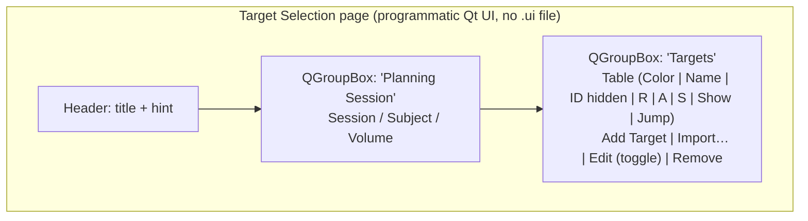
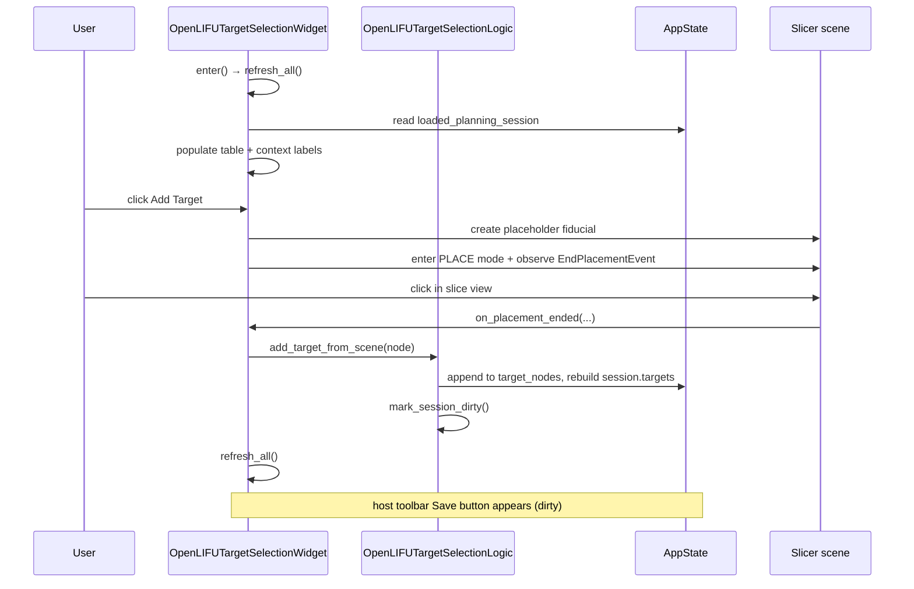

# Target Selection page

Living document — updated as the page changes.
Last major update: 2026-07-30.

## Source

`OpenLIFU/OpenLIFUApp/pages/target_selection_page.py`

## Purpose

The target-management half of the split legacy Pre-Planning module
(SlicerOpenLIFU#640). Shows the loaded PlanningSession's targets in
a single table with Add / Import / Edit / Remove actions. No virtual
fit anywhere on this page — that's the next page.

Splitting the legacy Pre-Planning into two pages (Target Selection
+ Virtual Fit) removes the ambiguity of the legacy design where a
targets-table selection and a VF-inputs "current target" could
point at different targets at the same time, producing a 3D scene
whose contents you had to reason about across two widgets.

Users reach this page via the workflow timeline in the host's fixed
footer (SlicerOpenLIFU#642). Target Selection is the second circle
on the Planning workflow timeline; the first is Planning Session
Overview. Volume Segmentation will eventually slot in ahead of
Target Selection; the workflow will become
`Overview → Volume Segmentation → Target Selection → Virtual Fit →
Solution Generator → Overview`.

## Screen layout

## Public API — Widget

Class: `OpenLIFUTargetSelectionWidget` (extends
`ScriptedLoadableModuleWidget`).

| Method | Called from | Purpose |
|---|---|---|
| `__init__(parent=None)` | host `_instantiate_page_widget` | Widget construction; sets `moduleName = "OpenLIFU"` and placement-mode flags. |
| `setup()` | host `_instantiate_page_widget` | Build the programmatic Qt UI once. Sets `self.uiWidget`. |
| `enter()` | host `_delegate_enter` | Sole first-render truth. Sets `is_entered = True`, calls `refresh_all()`. |
| `exit()` | host `_delegate_exit` | Sets `is_entered = False`. Cancels any in-flight placement so the user doesn't return to Home with an empty placeholder fiducial hanging around. Also syncs any 3D-drag changes to the openlifu Session (SlicerOpenLIFU#641) and forces edit mode off so returning locks every fiducial. |
| `cleanup()` | Slicer widget teardown | Cancels any pending placement observer. |
| `build_header()` / `build_context_group()` / `build_targets_group()` | `setup()` | Programmatic Qt UI construction. |
| `refresh_all()` | `enter()` + signal handlers after mutations | Rebuild context labels + table + action-button enablement + re-apply edit-focus lock (SlicerOpenLIFU#641). Idempotent. |
| `refresh_context()` | `refresh_all` | Repopulate the Planning Session context labels. |
| `refresh_targets_table()` | `refresh_all`, `on_edit_toggle` | Rebuild the targets table from `planning_session.get_target_nodes()`. Wrapped in `is_refreshing_table = True` so cell-change signals bail. |
| `populate_target_row(row, node)` | `refresh_targets_table` | Populate one row from a fiducial node. |
| `apply_edit_flag(item)` | `populate_target_row` | Set the item's `ItemIsEditable` flag from `is_in_edit_mode`. |
| `refresh_action_buttons()` | `refresh_all`, selection changes, edit-mode toggle, placement start / end | Gate Add / Import / Edit / Remove on the current mode (SlicerOpenLIFU#644): all four disabled while a placement is in-flight; Add / Import disabled while Edit mode is on. Escape is the sole cancel path during placement. |
| `on_add_button_clicked()` | signal | Start point placement: create placeholder fiducial, enter PLACE mode, observe `EndPlacementEvent`. |
| `on_placement_ended(caller, event)` | Slicer VTK observer | Register the placed target via `logic.add_target_from_scene`, or clean up the placeholder on cancel. After registering, selects the new row and toggles Edit mode ON so the just-placed fiducial is unlocked and immediately draggable (SlicerOpenLIFU#641). |
| `cancel_placement()` | `exit()`, `cleanup()` | Force-cancel: remove the observer, delete the placeholder, drop PLACE mode. |
| `on_import_button_clicked()` | signal | Show `ImportTargetDialog`; register the chosen scene fiducial or file-loaded fiducial. |
| `on_edit_toggle(checked)` | signal | Enter / exit Edit mode. Toggles cell edit triggers, rebuilds the table for `ItemIsEditable` flags, records / clears `edit_focus_row` for the selection-lock (SlicerOpenLIFU#644), and (on exit) calls `logic.sync_targets_from_scene()` so any 3D-drag changes get committed to the openlifu Session (SlicerOpenLIFU#641). |
| `apply_edit_focus_to_selection()` | `on_edit_toggle`, `on_targets_table_selection_changed`, `refresh_all`, `exit` | Unlock the selected fiducial (only when in edit mode); lock every other target fiducial. Called anywhere the selection or edit-mode state changes (SlicerOpenLIFU#641). |
| `select_row_for_node(node)` | `on_placement_ended` | Move table selection to the row whose Name cell carries `node` in its UserRole data. Used to select the just-placed target so edit mode focuses on it. |
| `on_targets_table_item_changed(item)` | signal | Cell edit: dispatch to `logic.rename_target` (Name) or `logic.move_target` (R/A/S). Bails during refresh / when not entered. |
| `on_targets_table_selection_changed()` | signal | Update Remove-button enablement. In edit mode, silently reverts user attempts to select a different row so selection stays locked to `edit_focus_row` (SlicerOpenLIFU#644); the user is committed to editing one target at a time. |
| `on_remove_button_clicked(_checked)` | signal | Confirm + `logic.remove_target(node)`. If the removed target was the one under Edit-mode focus, exits Edit mode (the `edit_focus_row` index would otherwise dangle) -- SlicerOpenLIFU#644. |
| `on_show_checkbox_toggled(node, checked)` | signal | `logic.toggle_visibility(node, checked)`. |
| `on_jump_button_clicked(node)` | signal | `logic.jump_to_target(node)`. |
| `on_targets_header_context_menu_requested(pos)` | signal | Right-click header menu to toggle hideable columns (currently just ID). |
| `selected_target_node()` | button handlers | Return the fiducial node stashed on the current row. |
| `show_info(text)` / `show_error(text)` / `confirm(text)` | any handler | Modal dialog helpers scoped to "Target Selection". |

## Public API — Logic

Class: `OpenLIFUTargetSelectionLogic` (extends
`ScriptedLoadableModuleLogic`). Consumable from a scripted test
without the widget.

| Method | Purpose |
|---|---|
| `add_target_from_scene(fiducial_node)` | Register an existing scene fiducial as a session target. Idempotent. Assigns a palette color; rebuilds `session.targets`; marks dirty; forces pack re-serialisation via `_persist_planning_session_changes` (SlicerOpenLIFU#641). |
| `import_target_from_disk(path)` | Load a fiducial file (`.mrk.json` / `.fcsv`), trim to a single control point, then `add_target_from_scene`. |
| `rename_target(target_id, new_label)` | Update the control-point label (user-visible name). Node name (== openlifu Point id) stays put so VF / solution refs remain valid. Marks dirty. |
| `move_target(target_id, ras_position)` | Update the fiducial position. Revokes any VF-approval flags for the target in the in-memory `virtual_fit_results` dict (a moved target can't count as "approved-at-old-position"). Marks dirty. |
| `remove_target(fiducial_node)` | Drop the fiducial from `target_nodes`, remove it from the scene, prune any `virtual_fit_results` entry keyed by that target. Marks dirty. |
| `sync_targets_from_scene()` | Force-sync openlifu `Session.targets` from the scene fiducials. Called on exit-edit-mode (Done) and on `exit()` to capture any 3D-drag changes that never went through `move_target` (SlicerOpenLIFU#641). No-op if nothing actually changed; marks dirty when it does. |
| `toggle_visibility(fiducial_node, visible)` | Pure scene mutation on the display node's `Visibility`. Does NOT mark dirty (visibility is not part of the openlifu Point). |
| `jump_to_target(fiducial_node)` | Snap slice views to the target's RAS position. |
| `_require_planning_session()` | Return the loaded PlanningSession or raise. |
| `_find_target_node(target_id)` | Look up a session target by openlifu Point id (through the pack's `target_nodes` list, not scene lookup). |
| `_rebuild_openlifu_targets(planning_session)` | Rewrite `planning_session.session.planning_session.targets` from the current fiducial nodes. Uses the wrapper-capture-mutate-write-back pattern so `@parameterPack` correctly re-serialises the change (SlicerOpenLIFU#641). |
| `_persist_planning_session_changes(planning_session)` | Force a full pack re-serialisation into the app state (`state.loaded_planning_session = planning_session`). Every mutation ends with a call here so the on-parameter-node representation stays consistent with in-memory mutations. Mirror of the legacy `parameter_node.loaded_session = session` idiom. |
| `_revoke_vf_approvals_for_target(planning_session, target_id)` | Flip every VF-approval flag for the target to False. Cross-page cascade to VF-node deletion / TT revoke / solution drops lives on the Virtual Fit page. |

## Dialog

Class: `ImportTargetDialog`. Two-tab picker: **From scene** (a
QListWidget of scene fiducials not currently registered) and
**From file** (a Slicer file dialog). Single call site so it stays
in-file per `docs/coding-standards.md` rule 7.

## State reads

* `get_app_state().loaded_planning_session` — the loaded pack.
* `planning_session.get_target_nodes()` — filtered target fiducials.
* `planning_session.session.planning_session` — the openlifu
  PlanningSession dataclass (`.name`, `.id`, `.subject_id`,
  `.volume_id`, `.virtual_fit_results`).
* Fiducial nodes: `.GetName()` (openlifu Point id),
  `.GetNthControlPointLabel(0)` (display name),
  `.GetNthControlPointPosition(0)` (RAS coords),
  `.GetDisplayNode().GetSelectedColor()`,
  `.GetDisplayNode().GetVisibility()`.

## State writes

Every user action goes through the Logic class, which:

1. Mutates the fiducial node in the scene where applicable.
2. Rebuilds `planning_session.session.planning_session.targets` from
   the current `target_nodes` list via
   `_rebuild_openlifu_targets(...)` so memory stays in sync.
3. Calls `OpenLIFULib.util.mark_session_dirty()` so a subsequent
   Save writes the session JSON.

Session lives in memory until Save — no disk writes from this page
(SlicerOpenLIFU#636).

## Signal flow

## Placement lifecycle

Add Target's PLACE-mode flow is the only long-running interaction on
the page. The lifecycle is:

1. Click Add → create placeholder fiducial node, add
   `EndPlacementEvent` observer on the interaction singleton, call
   `slicer.modules.markups.logic().StartPlaceMode(False)`.
2. User clicks in a slice view → Slicer places a point on the
   placeholder → fires `EndPlacementEvent`.
3. `on_placement_ended` removes the observer, checks whether a point
   was actually placed (Escape leaves 0 points), and either registers
   the target or deletes the placeholder.
4. If the user navigates away (`exit()`) while placement is
   in-flight, `cancel_placement()` runs: removes the observer,
   deletes the placeholder, drops PLACE mode.

All observer / placeholder state is on `self` -- no `slicer.util`
globals -- so the page can be reloaded / re-embedded without
leaking state.

## Edit-mode contract

The page enforces "you are editing ONE target at a time"
(SlicerOpenLIFU#644):

* **While `is_in_edit_mode == True`**:
  * `edit_focus_row` names the row that Edit mode focused on.
  * Add Target and Import are disabled -- user has to click Done
    before starting a new placement or import.
  * Table selection is locked to `edit_focus_row`. User attempts to
    click a different row are silently reverted (see
    `on_targets_table_selection_changed`).
  * The focused fiducial is the only one that's unlocked in 3D.
  * Remove stays enabled with its normal confirm dialog. Removing
    the edit-focus target auto-exits Edit mode so `edit_focus_row`
    doesn't dangle.

* **While a placement is in-flight (`placement_node is not None`)**:
  * ALL four action buttons (Add / Import / Edit / Remove) are
    disabled. Escape is the sole cancel path -- it fires
    `EndPlacementEvent` with 0 control points and cleans up the
    placeholder in `on_placement_ended`.
  * If the user navigates away mid-placement, `exit()` calls
    `cancel_placement()` to clean up.

## Design rationale

* **One "current target"**. The targets table's selection is the
  single source of truth for which target the user is acting on.
  There's no separate "algorithm inputs" combo like the legacy
  Pre-Planning had.
* **No cross-page reach-ins**. The Logic class only touches the
  loaded PlanningSession pack and the scene. It never calls into
  Sonication Planner, Transducer Localization, or any other page.
  The follow-on cascades (VF node removal, TT revoke, solution
  drop) live with the pages that own those artifacts.
* **`session.targets` stays in sync with scene**. Every mutation
  rebuilds the openlifu `targets` list from the current fiducial
  nodes. This means `save_loaded_session` writes the up-to-date
  list without any pre-save sync step -- simpler mental model than
  the legacy "sync at save time" approach.
* **Move revokes VF approval, not the whole VF entry**. A moved
  target's VF results might still be useful reference material;
  the user might want to re-approve them after they've inspected
  the new position. Deleting the entries wholesale would lose that.
  (Cross-page cascades that delete VF nodes / solutions live with
  those pages.)
* **Visibility is not part of the Point**. Toggling per-target
  visibility is a display-node operation and does not mark the
  session dirty. The openlifu Point has no visibility field.
* **Placement lifecycle is on the widget**. The placeholder-fiducial
  ↔ observer state is UI-lifecycle, not business-logic; keeping it
  on the widget lets `exit()` clean up cleanly without piping cancel
  state through the Logic class.

## Acceptance tests

Manual, until automated tests land:

1. Load a PlanningSession from Home. Overview appears with the
   footer's timeline strip showing two circles: Planning Session
   Overview (current, ringed) and Target Selection (reachable,
   hollow). Click the Target Selection circle. Target Selection
   opens; table populated from the loaded session (if the session
   had any targets).
2. Click **Add Target**. Click in a slice view. Table gets a new
   row; the fiducial appears in the 3D view and slice views. Session
   is marked dirty (host toolbar Save button appears).
3. Click **Add Target**, press Escape. Placeholder is cleaned up;
   table unchanged; session NOT marked dirty.
4. Click **Import…** → From scene tab. Pick an existing scene
   fiducial not already registered. Row appears; dirty.
5. Click **Import…** → From file tab. Browse to a `.mrk.json` or
   `.fcsv`. Row appears; dirty.
6. Click **Edit**. Rename a target via the Name cell; change R/A/S
   via the coordinate cells. Fiducial follows. Session dirty.
7. Toggle the Show checkbox on a row. Fiducial visibility flips.
   Session NOT marked dirty (visibility isn't persisted).
8. Click the → Jump button. Slice views snap to the target.
9. Select a target; click **Remove**; confirm. Fiducial removed
   from scene; row removed; any `virtual_fit_results` entry keyed
   by that target is gone from the in-memory dict.
10. Host toolbar Save → session written to disk. Data Manager and
    Planning Session Overview show the updated target count.
11. Exit → Discard → in-memory changes drop; disk unchanged.
12. Navigate to another page mid-placement (Add Target → click
    Add → immediately click Back to Home in footer) → placeholder
    is cleaned up (nothing dangling in the scene).

## Related

* [`../coding-standards.md`](../coding-standards.md) — rules
  followed here (enter-refresh, logic-vs-widget, no cross-page
  reach-ins).
* [`../data-model.md`](../data-model.md) — memory-first Save
  semantics.
* [`planning-session-overview.md`](planning-session-overview.md) —
  first workflow-timeline step; users navigate here to Target
  Selection via the footer timeline strip.
* SlicerOpenLIFU#640 — issue that scoped this change.
* SlicerOpenLIFU#642 — timeline-based navigation correction.
